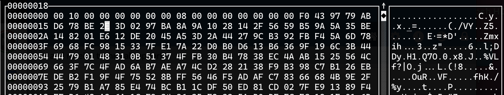

_Subtitle: hello GDB my old friend_

<a name="toc"></a>
<!--ts-->
* [Introduction](#introduction)
   * [Collaboration Policy](#collaboration-policy)
* [Program and Code Overview](#program-and-code-overview)
* [Hand in](#hand-in)
* [General tips](#general-tips)
* [Phase 1 Walkthrough](#phase-1-walkthrough)
* [Phase 2 Tips](#phase-2-tips)
* [Phase 3 Tips](#phase-3-tips)
* [Phase 4 Tips](#phase-4-tips)
* [Phase 5 Tips](#phase-5-tips)
* [Wrapping up and handing it in](#wrapping-up-and-handing-it-in)
* [Some hints](#some-hints)

<!-- Created by https://github.com/ekalinin/github-markdown-toc -->
<!-- Added by: langm, at: Thu Mar 30 23:10:10 CDT 2023 -->

<!--te-->

# Introduction

In this lab, you'll use the GDB debugger to debug a program that uses
offset-based data structures. __You will not write any code at all!__

You have been given a puzzle program that reads in-memory data structures in a
series of phases. The data structures, however, have been corrupted. For each
phase in the lab, your task is to:

* determine what corruption has occurred and the reason for the program
  crashing.
* modify the in-memory data structure in order to correct the corruption and
  allow the program to make progress to the next phase.
* Note that the corruption for each phase _does not affect the data stored in
  the data structure!_  __Only__ metadata and pointers in the data structure
  were corrupted.

There are five phases. This document walks you through completing the first
phase, and provides general guidance for each of the subsequent phases.

The objectives of this lab are:

* to gain more experience using GDB to debug programs and examine program state;
* to gain experience debugging programs that make heavy use of pointers and
  manual memory management/accounting;
* to gain experience reading and understanding code, and C code in particular;
* to gain experience reading and understanding technical documentation;
* and to gain experience examining and interpreting memory and using tools like
  GDB and hex editors to inspect memory.

This document is arranged as follows:

* First, we will take a tour of the source code that has been provided to you
  for this lab and examine the program you will debug.

* Next, we'll learn some background information about memory-mapped files and
  the `mmap` function. 

* Then, we'll look at each phase for this lab in turn and discuss strategies and
  guidance for progressing through them.

## Collaboration Policy

For this lab, collaboration is OK, __as long as you are sharing strategies for
discovering how to unlock the puzzle.__ You can and should talk about general
problems in the lab, __especially how to interpret, understand, and debug the
in-memory data structures!__ You should also be discussing how to use GDB to
examine _and interpret_ memory and how to use its various functions. You should
_not_ be telling people the specific modifications to make, or explaining
__exactly__ what corruption has occurred.

__When you make your PR, note who you worked with and on what
phases/sections/etc.__

🔝 [back to top](#toc)

# Program and Code Overview

Begin by cloning this GitHub repository on lily. Make sure that the first thing
that you do is __create a new branch!__

```
$ git clone <your-repo-url>
$ cd <your-repo>
$ git checkout -b <your-branch-name>
$ git status
$ ls
```

Let's begin by looking at what code is part of the lab. Files marked `-` are
library code used by the lab that you should not have to inspect. Files marked
`*` are executables that you can use to perform experiments and explore the data
structures, but are not strictly involved in the lab.

<!-- tree --charset ASCII -->
```
.
|-- doc ...................... Images used in this document
|-- README.md ................ This document
`-- src ...................... Main source directory
    |-- block_list_driver.c ...Block list driver (*)
    |-- block_list.c ......... Block list source (phase 4+5)
    |-- block_list.h ......... Block list header (phase 4+5)
    |-- boot.c ............... Main source file
    |-- boot.h ............... Main source header
    |-- db ................... Corrupt files 
    |   |-- log.ll ........... File for phase 4+5
    |   |-- nav.stb .......... File for phase 2+3
    |   `-- params.arr ....... File for phase 1
    |-- db-corrupt ........... Backups of corrupt files
    |   |-- log.ll_CORRUPT 
    |   |-- nav.stb_CORRUPT
    |   `-- params.arr_CORRUPT
    |-- disk_array_driver.c .. Driver for disk array (*)
    |-- disk_array.c ......... Disk array source (phase 1)
    |-- disk_array.h ......... Disk array header (phase 1)
    |-- Makefile ............. Build rules
    |-- mm_util.c ............ (-)
    |-- mm_util.h ............ (-)
    |-- nav_system.c ......... Executable entry point
    |-- strtable_driver.c .... strtable driver (*)
    |-- strtable.c ........... strtable source (phase 2+3)
    |-- strtable.h ........... strtable header (phase 2+3)
    |-- termcolors.h ......... (-)
    `-- util.h ............... (-)
```

You can build the binary `nav_system`. This is the main program that you will be
running, and your task for this lab is to make it run successfully to
completion. Since you're not going to be modifying source files, you'll only
really need to build this _once_.

```
$ cd src
$ make
$ ./nav_system
```

You'll notice that it will crash fairly quickly. The walkthrough for Phase 1
will help you get started in making progress toward getting the program to run.

Before you get started, take a look at `nav_system.c` (which contains `main`).
Then take a look at the source file that contains the majority of the program
logic that you will be debugging: `boot.c`.  This file has functions that load
and navigate a series of in-memory data structures.

The function `boot` at the bottom of `boot.c` runs the five phases in order.
These phases are clearly labeled. In the discussion of each phase below, we will
highlight them so as to direct our attention.

🔝 [back to top](#toc)

# Hand in

Create a file named `answers.md` in your branch by editing it with Vim. For
each of the phases, provide:

* a list of the modifications that you made to successfully fix the data
  structure.
* a description of how you found the memory corruption.

If you worked with anyone, please list them in the file and include how they
contributed.

🔝 [back to top](#toc)

# General tips

* __Your number one key to success: take this slow and give yourself plenty of
  heads-down time.__ Reading and understanding how the data structures are
  arranged in memory will require some time and some careful reading. __Your
  best friend for this lab will be a pen and a notebook.__ Take notes on the
  data structure memory organization. Draw diagrams. Do examples. Create example
  files using the driver programs and explore them using a hex editor (see phase
  1 tips).

* __Important:__ You will be spending __quite__ a bit of time using `gdb` and
  other programs __concurrently__ in this lab. I suggest you become used to
  using multiple `ssh` sessions to have multiple windows open. 

* You may want to invest a little time in learning how to use `tmux` to have
  multiple windows open in one `ssh` window. The course website has some
  [recommended tutorials](https://comp251.github.io/resources/vim/#tmux).

  __This is strictly optional, it's just a small process skill that may come in
  useful for you!__

* Remember the size of various types. `char` is always one byte (8 bits).
  `uint32_t/int32_t` is 32 bits (4 bytes), `uint64_t/int64_t` is 64 bits (8
  bytes). A byte is two hex digits and ranges from `00` (0) to `ff` (255).

* You may find the tips from lab 2 useful, as you refresh your knowledge of
  `gdb`.

* If you get tired of the "fluff" in the lab, look at `main` for the arguments
  that you can give to `run` in GDB to skip various parts of the program.

* __Ask for help!__

* The driver programs that have been provided for you will allow you to create
  example data structures. If you find it helpful, you can create small example
  data structures of a few hundred bytes and poke around at how they are
  implemented.

* __If you want to restore files to their initial version:__ There are four
  `make` targets you can use:

  * `make restore` restores all files
  * `make restore_params` restores the phase 1 file
  * `make restore_nav` restores the phase 2+3 file
  * `make restore_log` restores the phase 4+5 file

* __Remember that it is great to ask about this lab in class!__

* Each of the data structures in the lab is __heavily__ documented in its
  corresponding `.h` file. You __must__ read these files in order to be
  successful. You'll also need to use `gdb` to step through the code in these
  files!

* Each data structure has a similar representation: a `struct` representing the
  data structure with pointers to various locations in the memory used by the
  data structure. Each data structure additionally has a `mm_region_t` field:
  this describes information about the area of memory that the data structure
  occupies.

  The `mm_region_t` struct has the following fields:
  
  ```
  struct mm_region_t {
    void *start;
    size_t size;
    int fd;
  };
  ```

  The last field, `fd`, is not relevant to the lab. The `start` and `size`
  fields, though, point to the start of the memory region for the data structure
  and contain the total size for that region. These fields are __guaranteed to
  be correct!__

* You can examine memory by using arithmetic to compute values. For example, if
  I want to see 20 unsigned 32-bit integers before the end of a data
  structure's memory, I could do the following (presuming `ds` is my data
  structure):

  ```
  (gdb) x/20uw ds.mm_region.start + ds.mm_region.size - 20
  ```

🔝 [back to top](#toc)

# `mmap` and memory-mapped files

This lab is about debugging memory. It uses files, however, to store the data
that is going to be placed in memory. The way that data makes its way from a
file to memory is by using a function called `mmap`.  

This function allows a user to load a file from disk and store its entire
contents in memory.

When a user calls `mmap` to load a file, the user is given a pointer to the
start of the file and is then allowed to use the memory region containing the
file as a big region in memory. Since the memory region is valid and the caller
of `mmap` has a pointer to it, it is just a big area of the address space that
the user can do whatever they want with.

`mmap` has a couple of interesting options that make it incredibly useful:

* You can optionally tell `mmap` to write any changes that you make to memory
  back to the file, so that writing to memory _also_ writes to disk!

* The files `mmap` uses can be "anonymous," as well. This means that they are
  not really backed by a file, and are not located on disk or written back to
  disk.

  This is actually how modern versions of `malloc` are implemented: `malloc`
  calls `mmap` to get a region of memory that is not associated with a real
  file, and then uses this region to satisfy allocation requests.

* `mmap` can be used by different processes to share a region in memory (we will
  see this later in the semester).

🔝 [back to top](#toc)

# Phase 1 Walkthrough

To help get you started, the following will walk you through phase 1.

* First, let's run the program.

  ```
  $ cd src
  $ ./nav_system
  ```

  As expected, it crashes.

* Let's run the program using `gdb` and see exactly where this crash occurs.

  ```
  $ gdb nav_system
  (gdb) run
  ... crash!
  (gdb) info stack
  ```

  Here, we see the sequence of function calls that took us to the crash. 

  If we want to switch between function calls to examine the variables in each
  function, we can use the `frame` command.

  ```
  (gdb) frame <number>
  ```

  However, if we crashed in `load_params`, we're in a good spot to start looking
  at why we crashed. In later phases, you will want to go up the stack to look
  at the variables in the function to see how the program got to where it is.

* Let's look at `load_params`. Open up the source code for
  `boot.c` (either in GitHub or in another SSH window). Lets look at the source
  to `load_params`.

  What we see here is that `load_params` does a few simple things:
  
  1. Declares something called a `disk_array_t` and opens it.
  2. Copies a pointer out of that struct and into a pointer.
  3. Treats that pointer like an array and iterates over the array.
  4. Prints each value.
  5. Closes the disk array.

  In order for us to really understand what the bug is, we will need to
  understand what a disk array is, and what could possibly cause this bug.

* Open `disk_array.h` and `disk_array.c` as tabs in a browser or in Vim. 

  > Aside: If you use Vim, a helpful tip is that you can split-screen the editor!
  > Use `:vsplit <file-name>` to open a vertical split with a new file, or
  > `:split <file-name>` to open a horizontal split. Use `CTRL-w <direction>` to move
  > between them (direction can be arrow keys or `hjkl` directions).

  `disk_array.h` defines our first data structure: an array type that uses
  `mmap` to store itself on disk. A disk array is a struct that contains some
  metadata about the `mmap`ed file, some metadata about the number of elements
  it can store, and a pointer to the start of the actual data array.

  Read the documentation for the data structure __carefully__. You can see that
  the memory used by the struct is organized so that there are two important
  variables located at the beginning of the memory it uses: a 64-bit integer
  storing the number of elements and a 64-bit integer storing the size of each
  element.

  Take a look at the struct definition and how those values are represented in
  the struct.

  Read through `array_open` in `disk_array.c` to see how these values are
  initialized.

* Now let's go back to `gdb` and take a look at what we have for our array that
  is being used in our program.

  ```
  (gdb) info locals
  params = {array = 0x7ffff7ff6010, n = 0x7ffff7ff6000, element_size = 0x7ffff7ff6008,
      mm_region = {start = 0x7ffff7ff6000, size = 2064, fd = 3}}
  arr = 0x7ffff7ff6010
  ```

  Here we see the `params` struct and the `arr` pointer. You can see the effect
  of copying the `params.array` pointer to `arr` -- they both point to the same
  address.

  You can also see how the pointers are laid out in memory! 

  * Notice how the
    memory mapped region starts at address `0x7..ff6000`. This is where `n` (the
    number of elements) is located, as well (remember the description of the file
    type!). 
  * `element_size` is located at `0x7..ff6008` -- eight bytes later
    (recall that a 64-bit integer is 8 bytes). 
  * Finally, the array starts at `0x7..ff6010` -- 16 bytes after `0x7..ff6000`
    and 8 bytes after `element_size` (this is hex, so each digit is 0-f).

* So, let's take a look at that memory.
  
  We can do this in a couple of ways:

  * We can dereference the pointers:
    
    ```
    (gdb) print *params.n
    (gdb) print/z *params.n    # as hex
    (gdb) print *params.element_size
    (gdb) print/z *params.element_size     # as hex
    ```

  * We can dereference the address using `print`:

    ```
    (gdb) print *(0x7ffff7ff6000)
    (gdb) print/z *(0x7ffff7ff6000)
    ```

    The second version of `print` applies a format specifier -- to print the
    number using zero-padded hex. However, `print` is showing us something
    incorrect here -- you may notice that the value is incorrect! It is
    intrepreting the memory as a 32-bit number.  We can also tell `print` how to
    interpret the memory.

    ```
    (gdb) print *((uint64_t*)0x7ffff7ff6000)
    ```

  * Examining memory is not really a good task for `print` -- it is better for
    executing arbitrary expressions and printing variables. Instead, we can
    examine memory using the `x` command:

    ```
    (gdb) x/gz 0x7ffff7ff6000
    (gdb) x/gd 0x7ffff7ff6000
    ```

    When we print memory like this, we need to tell gdb __how to interpret__ the
    memory. After all, bits are bits and have no inherent meaning!

    Use `help x` to see the format specifiers. You can see that we are saying
    that this is a 64-bit (8 byte) value.

  * `x` also allows to look at blocks of memory by specifying a repeat
    statement. Try the following:

    ```
    (gdb) x/2gz 0x7ffff7ff6000  # look at first two 64-bit vals in hex
    (gdb) x/2gd 0x7ffff7ff6000  # look at first two 64-bit vals in decimal
    (gdb) x/16z 0x7ffff7ff6000  # look at first 16 bytes in hex
    (gdb) x/64z 0x7ffff7ff6000  # look at first 64 bytes
    ```

    Cool, right (well, for my definition of "cool")?

  * One more experiment. Let's look at memory byte-by-byte vs. looking at it as
    integers:

    ```
    (gdb) x/2xg 0x7ffff7ff6000   # two 64 bit ints, in hex
    (gdb) x/16xb 0x7ffff7ff6000  # 16 bytes, in hex
    ```

    Here's the output:

    ```
    (gdb) x/2xg 0x7ffff7ff6000
    0x7ffff7ff6000: 0x0000000000001000      0x0000000000000008
    (gdb) x/16xb 0x7ffff7ff6000
    0x7ffff7ff6000: 0x00    0x10    0x00    0x00    0x00    0x00    0x00    0x00
    0x7ffff7ff6008: 0x08    0x00    0x00    0x00    0x00    0x00    0x00    0x00
    ```

    Do you notice something weird here? The byte order looks reversed! There's
    nothing really strange happening, though. What we are seeing is that
    multi-byte values are stored in __little-endian__ order. This means that the
    smallest bytes in a number are stored __first__ in memory, and the largest
    bytes are stored __last__.

    For example, let's look at storing the number 0xa0b0c0d0 in memory at
    address `0x6000`. 

    ```
    value          a0 b0 c0 d0
    byte number     3  2  1  0
    ```

    The bytes are going to be stored in memory in increasing addresses. That
    means that that the byte number increases with the address.


    ```
    address       6000 6001 6002 6003
    byte number      0    1    2    3
    value           d0   c0   b0   a0
    ```

    Since this is awkward to read when we are looking at these bytes as a single
    value, GDB rearranges them when we interpret those addresses as one number
    and shows us `a0b0c0d0` -- what we expect. 

    You can read more about endianness
    [here](https://en.wikipedia.org/wiki/Endianness) __or in [Chapter
    4.7](https://diveintosystems.org/book/C4-Binary/byte_order.html) of our
    textbook.__

* So, let's get back to debugging. We can see that the program crashed with a
  segmentation fault trying to read and print memory. Lets see what address we
  were reading:

  ```
  (gdb) info locals
  ```

  We can see `i` has some value, and we were reading `arr[i]`.

  ```
  (gdb) print i
  (gdb) print arr[i]
  ```

  Uh oh. What's going on? It seems like this is not a valid address? Given `n`,
  it should be. Since each element is 8 bytes, and there are 4096 elements, we
  expect that the address of `arr[i]` is within the data structure.

  Let's validate that:

  ```
  (gdb) print &arr[i]  # print address of array element i
  (gdb) print &arr[i] < (0x7ffff7ff6000 + 4096*8)  # print comparison
  ```

  That should've printed a `1` for you as well, meaning that we should be
  accessing a valid address at `arr[i]`. But we're not. 

  That's suspicious.

  If we look again at the struct, something is not adding up right.

  ```
  (gdb) print *params.n * *params.element_size
  (gdb) print params.mm_region
  ```

  That size (in bytes) looks __way__ too small. 

  Let's see how big the file is (in another window):

  ```
  ls -l db/params.arr
  ```

  It doesn't look like `n` is accurate! In fact, we __know__ that `n` is
  inaccurate now, and we know what it __should__ be.

* Before we fix this, let's take another look at the file (which also
  corresponds to what is in memory) using another program/tool: a _hex editor_.
  In a separate window, let's examine the contents of the file.

  Here, you have several options for programs to use. We're going to look at a
  few. Some are standard on almost all Unix/Linux systems and some are not, but
  are installed on lily.

  1. First, we'll use `hexcurse`.
     
     ```
     $ hexcurse db/params.arr
     $ man hexcurse  # for the manual
     ```

     When you open the file, you'll notice a line of commands along the bottom.
     These are accessed with the function keys (F1-F8).

     
     
     The main screen has a dump of the file byte-by-byte in hexadecimal, with
     each row starting with the address of the first byte in that row. At the
     very top is a number indicating the byte offset of the cursor. On the right
     hand side is the ASCII interpretation of each byte.

     

     If we scroll to the very bottom of this file, we see it stops at byte
     `0x80f`, which, in decimal is 2063, meaning `ls -l` was correct and there
     are 2064 bytes in this file (numbered 0-2063), __not__ 32k (as claimed in
     the header).

  2. Next, we'll use `hte`.

     ```
     $ hte db/params.arr
     $ man hte  # for the manual
     ```

     You'll notice that the window is very similar! Along the bottom are
     commands, each accessed using a function key. The main window is almost
     exactly the same.

     

     Along the top is a menu bar. Letters are highlighted and can be accessed
     using `ALT+<letter>` (or "option" if you have a MacOS keyboard).

     

     One of the most powerful features of `hte` is the expression evaluator,
     which allows you to interpret the bytes under the cursor in different ways,
     or to evaluate arbitary expressions.

     For example, place your cursor at the beginning of the file and type
     `ALT-e` followed by `e` to bring up the expression evalutor. 

     Type `u64` and hit enter. You just told the evaluator to interpret the 8
     bytes starting at your cursor as an unsigned 64-bit integer (and we see
     that this is indeed 4096). Hit `ALT-f` to see all the functions that the
     expression evaluator can use (use `ESC` to go back).

     

     

     It can also be used as an abitrary calculator, like `print` in GDB. Let's
     make sure that the file size is what we think it is (again).

     

  3. Now, we'll look at a trio of tools for dumping a hex interpretion of a
     file: `hexyl`, `hexdump`, and `xxd`.

     These are not editors -- they just show you the contents of a file in
     hexidecimal. Try the following:

     ```
     $ xxd db/params.arr 
     $ xxd db/params.arr | head -n 20  # view first 20 lines
     $ xxd db/params.arr | tail -n 10  # view last 10 lines
     $ hexdump db/params.arr | less    # view in less (q to exit)
     $ hexdump db/params.arr
     $ hexyl db/params.arr
     ```

     The `|` with `head`, `tail`, and `less` can be used with any program.

     `xxd` is installed by default on nearly __all__ Linux and Unix systems.

* Okay, so now we know the problem: The file size is 2064 bytes. The header
  takes up 16 bytes (2 8-byte numbers). That means that there are 2048 bytes
  remaining for the array elements. Since each element is 8 bytes, the number of
  elements should be 256, __not__ 4096.

  Now it's time to fix this!

  Let's kill the crashed program and re-run it. We'll set a breakpoint before we
  crash, and fix the corruption __before__ the program reads that memory and
  acts on it.

  ```
  (gdb) break boot.c:29    # set a breakpoint right before the for loop
  (gdb) kill               # kill the running program
  (gdb) run                # run the program from the start
  ```

  The next part here is cool. We can use GDB to __change memory of the running
  program!__

  The `print` function allows this:

  ```
  (gdb) print *params.n
  (gdb) print *params.n = <the correct number of elements>
  (gdb) print *params.n
  ```

  Notice how the value changed!

  You can also use the `set` function in gdb to achieve the same result:

  ```
  (gdb) print *params.n
  (gdb) set *params.n = <the correct number of elements>
  (gdb) print *params.n
  ```

  If you view a hex dump of the file, you should see that the file changed as
  well (since `mmap` writes changes back to disk)!

  ```
  $ hexyl db/params.arr | head
  ```

  Before we move on, note that we just __permanently changed the file__. This
  means that we have fixed the memory corruption and now whenever we run the
  program again, we won't crash here.

  If you ever need to start over after writing to memory and changing the file,
  you can always `make restore_XXX` to restore the file for the phase you are
  working on (see the description of these targets in the
  [general tips](#general-tips) section).

  Make sure that you take careful notes as you are working. You __will__ need
  them.

* Type `cont` in GDB to continue running the program! We just passed phase 1!

* Before you move on, __write your first answer in `answers.md`__.

🔝 [back to top](#toc)

# Phase 2 Tips

The next two phases use a different data structure--one that I've called a
`strtable`. This data structure is an indexable table of strings that are stored
in contiguous memory.

The `strtable` data structure that you will be fixing has been corrupted in a
few small ways. Before you dive into fixing it, it will be important to
understand the memory layout of the data structure. Make sure that you spend
some time reading `strtable.h`.

__Tips for Phase 2:__

* You can create a very small `strtable` to experiment with. Run `$
  ./strtable_driver`

  Type `n test_table 50` to create a small string table that can store 50 bytes
  of data. Then add a few strings:

  ```
  > a one-string
  > a another
  > a last
  > c
  > q
  ```

  This creates a very small string table that we can try to understand by
  inspection. Dump it with `hexyl test_table.stb` or `xxd` to see its contents.
  Here you can see the strings (each of which is null-terminated), the index,
  and the header section with the number of elements (3) and the size (50 =
  0x32).

  

  Remember that you can use `hte test_table.stb` to use the calculator in `hte`
  as well, which will come in handy when interpreting the index of the table.
  Each entry in the index is a 32-bit int (you can see its definition in
  `struct table_element`).

  Understanding the layout of this small file will help you fix the larger file.
  Feel free to experiment and create slightly larger tables with more strings
  (this one is just about full).

* Remember to use `info stack` followed by `frame <number>` to go back to a
  particular function.

* You can dereference chains of structs that point to one another. For example:
  `print nav_db->metadata->size`

* By examining the file format, you will notice that element offsets should be
  correlated with one another: `print nav_db.elements[0]` is the offset of element 0 and 
  `print nav_db.elements[1]` is the offset of element 1. 

* If you want to look at the last 30 lines of output, remember you can always
  use the tail command to do that: `hexyl nav.stb | tail -n 30`

* You can set an address with `print` too:
  `print *(address expression) = <value>` 

* To write a single byte, make sure that you tell `print` to interpret
  the address as a byte: `print *((char *) address expression) = '<char>'`

* I said that the _data_ has not been corrupted; in this case, _data_ does not
  include the null terminators.

🔝 [back to top](#toc)

# Phase 3 Tips

__Tips for Phase 3:__

* For this section, it is doubly important that you understand the `strtable`
  format. In that format, the offset of a string is related to the offsets and
  lengths of the strings that surround it.

* If you want to look a block of memory as bytes, remember to use the repeat
  modifier for `x`: e.g., `x/30c (address expression)`

* Remember that you can do arithmetic with `print`. For example, you can use an
  expression like this to compute the address of the end of the file: `print/x
  nav_db->mm_region.start + nav_db->mm_region.size`

🔝 [back to top](#toc)

# Phase 4 Tips

In this phase and the next, you'll be using a data structure that I called a
_block list_. This is essentially a linked list of data elements (called blocks)
that users can add to and access in sequence.

You will find documentation for the format in `block_list.h`. Take some time to
read through it. It is important that you understand the memory layout for this
data structure.

__Tips for Phase 4:__

* Like `strtable`, there is a small driver program that you can run to create
  and interact with block lists. Run `$ ./block_list_driver`. 

  Type `m test_list 64` to create a small block list. The total amount of data
  this can store is 64 bytes. Given that there are 8 bytes used for both the
  empty head and tail nodes of the list, this means that we have 48 bytes that
  we can use for data. Each block uses 8 bytes for its header and footer, so if
  we create three blocks and make sure that the block sizes add up to 24, we can
  use the entire file (24 + 3\*8 = our 48 bytes remaining).

  ```
  > a 10 a
  > a 4 b
  > a 10 c
  ```

  This adds a block of 10 `a`s, a block of 4 `b`s, and a block of 10 `c`s.

  If we dump the file using `hexyl test_list.ll`, you can see the null head and
  tail nodes, as well as the header and footers with the size of each block!

  

  Remember that you can use `hte test_list.ll` to use the calculator in `hte`.
  Like `strtable`, you should experiment with the driver program and the hex
  editor to get a sense of what is happening in the file.

* Remember that you can do address arithmetic with `print` and can dereference
  expressions of your own that result in addresses; this can include
  subtraction: `print/x *(address - offset)`

  This also works for assignment: `print/x *(address - offset) = val`

🔝 [back to top](#toc)

# Phase 5 Tips

The last phase! Good work!

__Tips for Phase 5:__

* Phase 5 is not radically different from the other phases, and with the tools
  that you have gained so far, you should be well-equipped for this phase.

* Where the program crashes should give you a good idea of where to look in the
  file for the corruption. You shouldn't have to look too far from the start,
  and where the program crashes and its output should be a good clue for where
  to look.

🔝 [back to top](#toc)

# Wrapping up and handing it in

Congratulations! I hope that this was a novel experience for you and a good
deep-dive into learning how to debug pointer and offset-based structures!

When you are ready to submit, make sure that you add your fixed files __and__
your answers.

```
$ git add src/db/params.arr
$ git add src/db/nav.stb
$ git add src/db/log.ll
$ git add answers.md
```

Make sure that you commit, push, and create a pull request.

🔝 [back to top](#toc)

# Some hints

* Phase 2: There are two issues; one is similar to phase 1 and the other is some
  corruption of data. What do all strings end with?
* Phase 3: It looks like a string was read incorrectly from the file. Where does
  the index/offsets say that string should start?
* Phase 4: Looks like we read too far... What should've made us stop reading
  sooner?
* Phase 5: Block sizes appear twice (header and footer).

🔝 [back to top](#toc)
